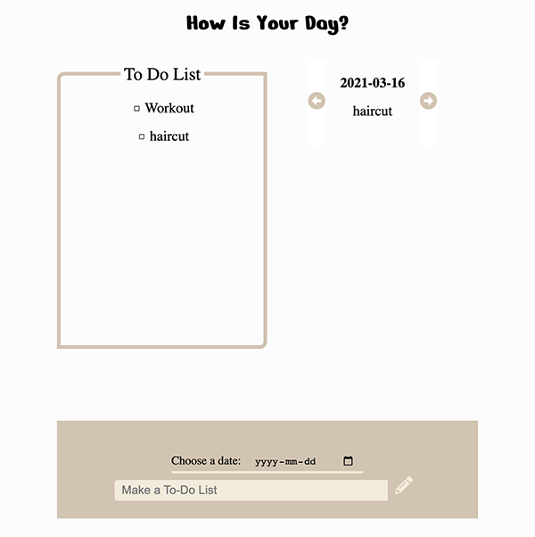
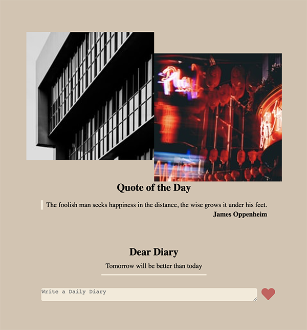

<h1 align="center">
How is your day
</h1>
<p align="center">
   <a href="https://github.com/dbwjd5864/Diary/blob/master/LICENSE">
      
   </a>
</p>

### **Frontend** - React

### **Backend** - Node js, Express, MongoDB

<br>

> "How is your day" is a full-stack web application built with the MERN stack with webpack. You can add your to-do list and write your feelings about the day. The Quote of the day is also shown under dear Diary section.

Live Demo : <a href=https://howisyourday.herokuapp.com> Click here :) </a>

## Quick Start

1. Fork the repository and Clone it.
2. Add your .env file under server folder

```javascript
NODE_ENV = 'development';
DB_CONNECTION = 'your mongodb_url';
```

3. Now run the app

```bash
# Install dependencies
npm install
# Run the client & server with concurrently
npm run dev
# App runs on http://localhost:3000`
```

## Contents

<p float='left' align='middle'>


<p align='middle'>ToDo || Dear Diary</p>
</p>

## Information

### Author

[Yujeong Choung](https://howisyourday.herokuapp.com/)

### Version

1.0.0

### License

[MIT License](https://github.com/dbwjd5864/Diary/blob/master/LICENSE)
